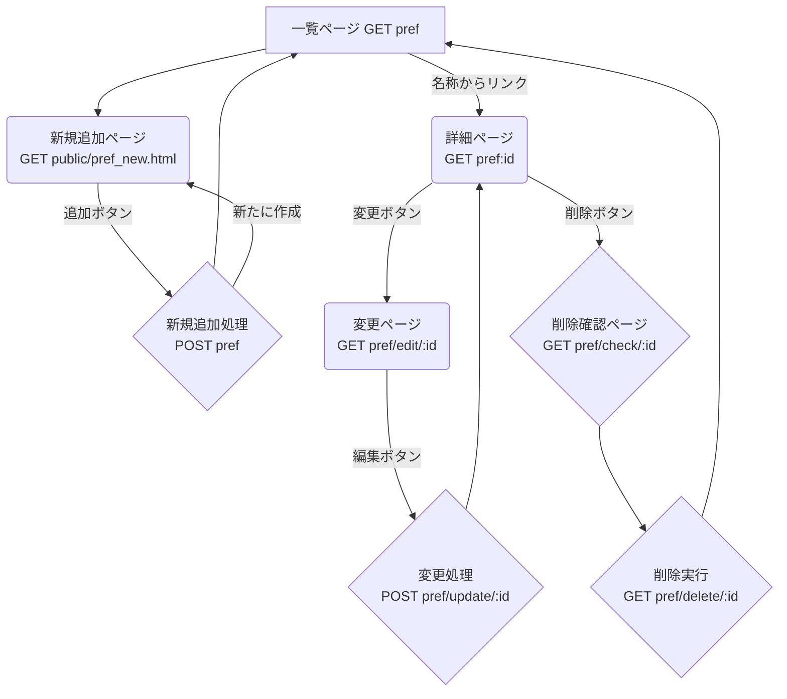

```mermaid
graph TD
    A[一覧ページ GET pref] --> |名称からリンク|B(詳細ページ<br>GET pref:id);
    A --> C(新規追加ページ<br>GET public/pref_new.html);

    C --> |追加ボタン|D{新規追加処理<br>POST pref};
    D --> A;
    D --> |新たに作成|C;

    B --> |変更ボタン|E(変更ページ<br>GET pref/edit/:id);
    B --> |削除ボタン|F{削除確認ページ<br>GET pref/check/:id};

    E --> |編集ボタン|G{変更処理<br>POST pref/update/:id};
    F --> H{削除実行<br>GET pref/delete/:id};

    G --> B;
    H --> A;


```
