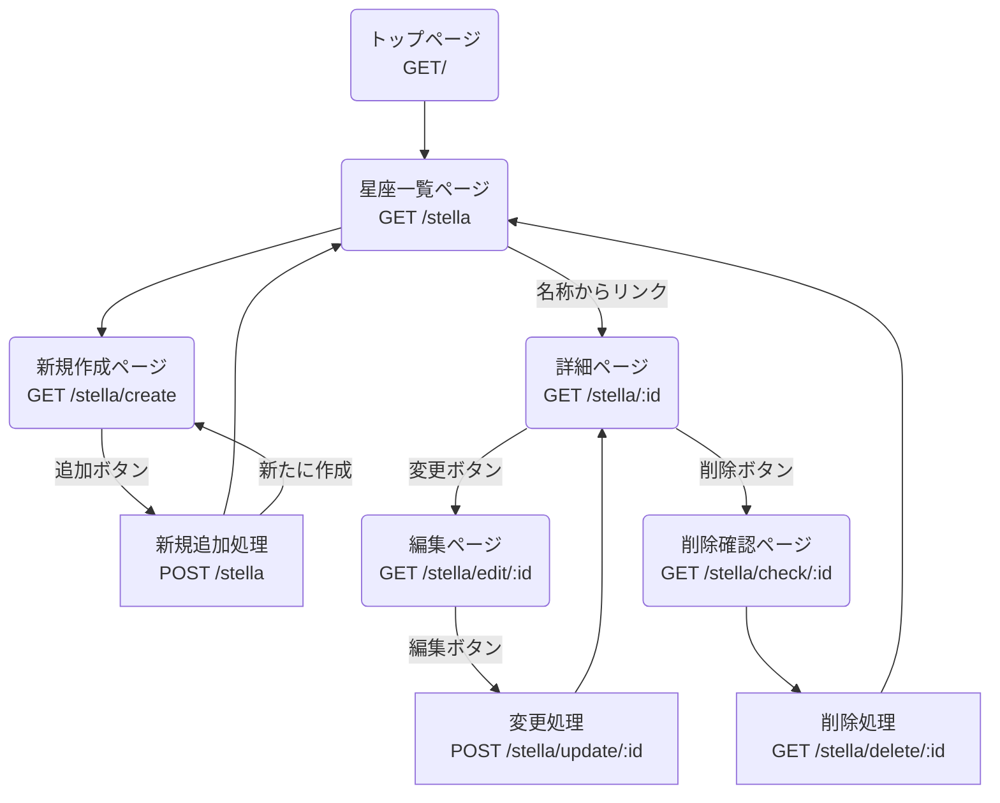

```mermaid
graph TD
    L(トップページ<br>GET/);
    L --> A(星座一覧ページ<br>GET /stella) --> |名称からリンク|B(詳細ページ<br>GET /stella/:id);
    A --> C(新規作成ページ<br>GET /stella/create);

    C --> |追加ボタン|D[新規追加処理<br>POST /stella];
    D --> A;
    D --> |新たに作成|C;

    B --> |変更ボタン|E(編集ページ<br>GET /stella/edit/:id);
    B --> |削除ボタン|F(削除確認ページ<br>GET /stella/check/:id);

    E --> |編集ボタン|G[変更処理<br>POST /stella/update/:id];
    F --> H[削除処理<br>GET /stella/delete/:id];

    G --> B;
    H --> A;


```
