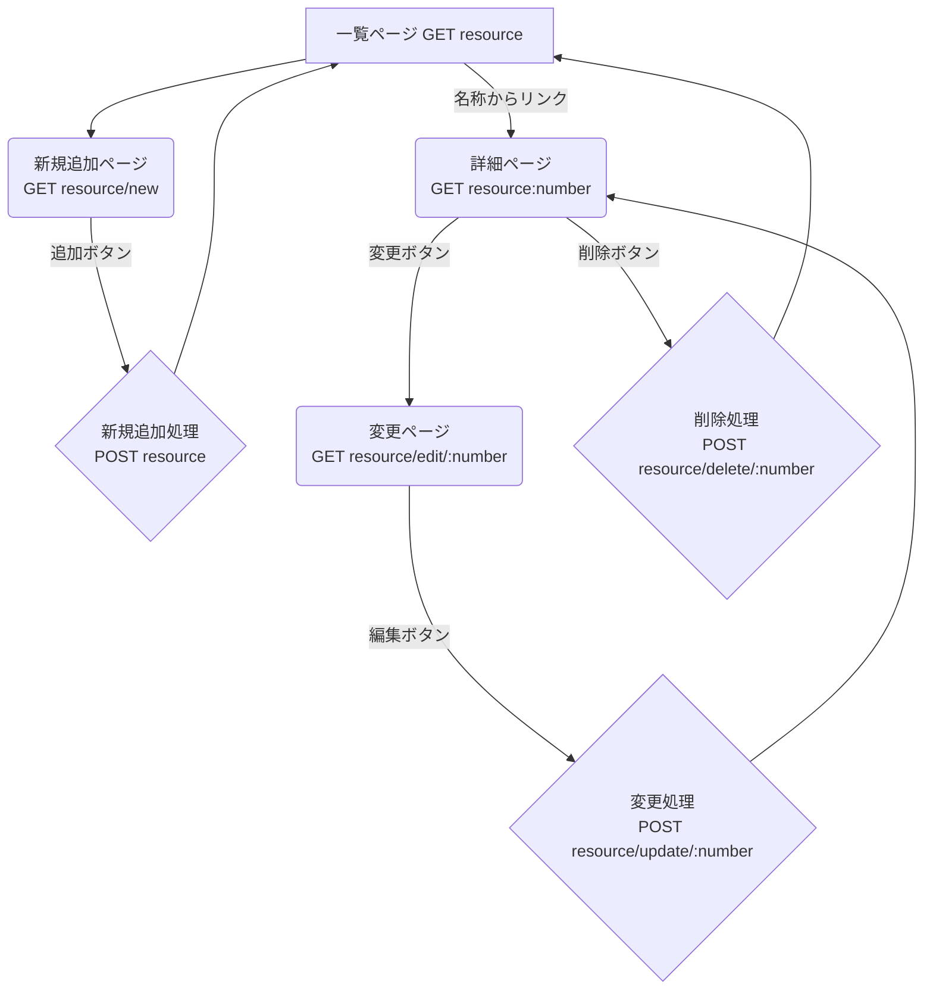

```mermaid
graph TD
    A[一覧ページ GET resource] --> |名称からリンク|B(詳細ページ<br>GET resource:number);
    A --> C(新規追加ページ<br>GET resource/new);

    C --> |追加ボタン|D{新規追加処理<br>POST resource};
    D --> A;

    B --> |変更ボタン|E(変更ページ<br>GET resource/edit/:number);
    B --> |削除ボタン|F{削除処理<br>POST resource/delete/:number};

    E --> |編集ボタン|G{変更処理<br>POST resource/update/:number};
    G --> B;
    F --> A;
```
